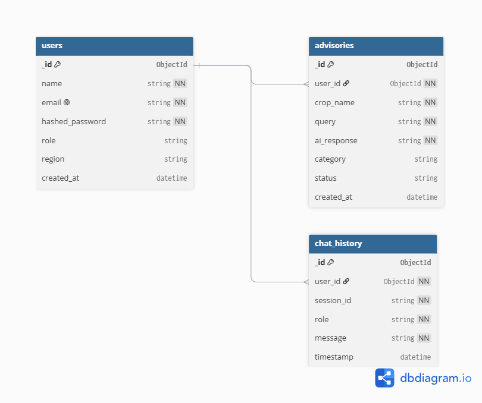

# Agri-Allied — Crop Advisory Platform

Agri-Allied is a full-stack, AI-powered agricultural advisory platform designed specifically for field supervisors of the organic farming collective in Almora, Uttarakhand, India. 

Field supervisors can input crop symptoms, pest issues, and post-harvest queries in plain language and receive practical, organic-compliant, hill-calibrated advice powered by Google's Gemini AI.

---

## Project Tech Stack

- **Frontend**: React (Vite) + Tailwind CSS + React Router
- **AI Model**: Google Gemini (`gemini-2.0-flash` with fallback to `gemini-1.5-flash`)
- **Theme**: Earthy Himalayan-agriculture styling:
  - Deep Pine Green (`#1B4332`)
  - Warm Terracotta Accent (`#BC6C25`)
  - Cream/Off-White Background (`#FAF6EF`)
  - Soft Charcoal Text (`#2D2A26`)
  - Typography: Serif headers (Fraunces / Spectral) paired with clean Sans-serif body (Work Sans).

---

## Directory Structure

```text
/
├── backend/
├── frontend/
│   ├── src/
│   │   ├── components/    # Navbar.jsx, Hero.jsx, Card.jsx, Footer.jsx
│   │   ├── pages/         # Home.jsx, About.jsx, Dashboard.jsx, Login.jsx
│   │   ├── App.jsx        # Routing & layouts
│   │   ├── main.jsx       # Entry point
│   │   └── index.css      # Core styles & custom typography
│   ├── tailwind.config.js # Tailwind color definitions
│   └── index.html         # SEO titles & meta tags
└── README.md              # Startup documentation
```
---

## How to run backend locally

1. Navigate to the backend directory:
   ```bash
   cd backend
   ```
2. Create a virtual environment:
   ```bash
   python -m venv venv
   ```
3. Activate the virtual environment:
   - On Windows (PowerShell):
     ```powershell
     .\venv\Scripts\activate
     ```
   - On Windows (Command Prompt):
     ```cmd
     .\venv\Scripts\activate.bat
     ```
   - On macOS/Linux:
     ```bash
     source venv/bin/activate
     ```
4. Install dependencies:
   ```bash
   pip install -r requirements.txt
   ```
5. Run the FastAPI development server on port 5000:
   ```bash
   uvicorn main:app --reload --port 5000
   ```

---

## Week 5: Authentication & MongoDB Atlas Integration

We transitioned the platform storage from in-memory arrays to **MongoDB Atlas** using the **Beanie ODM** (Object Document Mapper) and implemented a robust role-based authentication system.

### 1. Data Models (MongoDB Collections)

#### User (`users`)
Exposes safe profile information for supervisor sessions:
- `id` (ObjectId): Unique identifier.
- `name` (string): Supervisor's name.
- `email` (string, unique): Used for authentication.
- `phone` (string): Contact details (owner-only access).
- `hashed_password` (string): Hashed password.
- `created_at` (datetime): Account creation timestamp.

#### Advisory (`advisories`)
User-linked crop diagnosis and advisory recommendations:
- `id` (ObjectId): Record identifier.
- `userId` (string): Link to the owner `User.id`.
- `crop` (string): Target mountain crop (e.g. apple, beans).
- `query` (string): Field symptoms or supervisor query.
- `advice` (string): organic/AI advice recommendations.
- `status` (string): `"open"` or `"resolved"`.
- `createdAt` (datetime): Creation timestamp.

#### ChatMessage (`chat_messages`)
Chronological persistent storage for Gemini-powered organic chats:
- `id` (ObjectId): Message log identifier.
- `userId` (string): Link to the owner `User.id`.
- `role` (string): `"user"` or `"assistant"`.
- `content` (string): Chat message details.
- `createdAt` (datetime): Log timestamp.

### 2. Authentication Overview

- **Password Security**: Passwords are never stored as plain-text. They are hashed using **Bcrypt** (`passlib[bcrypt]`) before database insertion.
- **Session Tokens**: Authenticated routes are protected with **JSON Web Tokens (JWT)** (`python-jose`). Access tokens expire after 24 hours.
- **Data Isolation**: Route actions (listing, searching, updating, deleting, and logging chats) are automatically locked to the active user's session ID decoded from the JWT token.
- **Auto-Seeding**: On startup, if no users are registered, the system automatically creates a default test account (`supervisor@agriallied.org` / `password123`) and seeds the 5 Week-4 crop advisories linked directly to it.

### 3. Setup and Secrets

To connect to MongoDB Atlas and sign JWT tokens, add these parameters to your `.env` file in `/backend/`:
```text
MONGO_URI=mongodb+srv://<username>:<password>@<cluster>.mongodb.net/agri_allied?retryWrites=true&w=majority
JWT_SECRET=your_jwt_signing_secret_here
```


---

## API Documentation

Full endpoint reference (all 18 routes, request/response examples, error codes): see [`API_DOCUMENTATION.md`](API_DOCUMENTATION.md). Interactive Swagger UI is also available at `http://localhost:5000/docs` when the backend is running.

---

## Database Choice and Why

We use **MongoDB Atlas** (cloud-hosted NoSQL) with the **Beanie ODM**. The app stores flexible, document-shaped data — chat messages, AI advisories, and reset tokens — that doesn't need rigid relational tables and evolves week to week. Beanie's async API pairs naturally with FastAPI's async request handling, and Atlas gives us a free managed cluster with backups and a browser UI for inspection.

### Schema Diagram



### Set up the database

1. Create a free cluster at [MongoDB Atlas](https://www.mongodb.com/cloud/atlas).
2. Add a database user (username + password) under **Database Access**.
3. Under **Network Access**, allow your IP (or `0.0.0.0/0` for development).
4. Copy the connection string and set it in `backend/.env` as `MONGO_URI` (database name: `agri_allied`).
5. Start the backend — collections are created automatically and a test supervisor plus 5 sample advisories are seeded on first run.

---

## Week 6: Authentication Hardening & Google OAuth

- **Rate limiting** (`slowapi`): `POST /api/auth/login` and `POST /api/auth/signup` are limited to **5 requests per 15 minutes per IP** and return `429` when exceeded.
- **Input validation** (Pydantic): `EmailStr` email validation; passwords require min 8 characters with at least one letter and one number; duplicate registration returns a clean `400 — Email already registered`.
- **Google OAuth 2.0** (Authlib): `GET /api/auth/google` redirects to Google's consent screen; the callback finds-or-creates the user (`provider: "google"`, no password stored), issues our own JWT, and redirects to the frontend `/oauth-callback` route which stores the token and loads the session.
- **Protected frontend routes**: `/dashboard`, `/chat`, and `/advisories/:id` are wrapped in a `ProtectedRoute` component that redirects unauthenticated visitors to `/login`. Logout clears the token and session.
- **Password reset flow**: `POST /api/auth/forgot-password` issues a single-use, SHA-256-hashed token valid for 30 minutes (emailed via SMTP, or logged to console in dev); `POST /api/auth/reset-password` verifies and consumes it.

New `.env` variables: `GOOGLE_CLIENT_ID`, `GOOGLE_CLIENT_SECRET`, `SERVER_URL`, `FRONTEND_URL` (see `backend/.env.example`).

---

## Week 7: AI API Integration (Google Gemini)

- **Endpoint**: `POST /api/ai/advisory` (JWT-protected; also mounted at `/api/chat`) sends the full conversation history to **Gemini `gemini-2.5-flash`** with a domain-locked system prompt (organic mountain farming, Uttarakhand) and returns the advisory reply.
- **Persistence**: every user question and AI reply is saved to the `chat_messages` collection, and `GET /api/chat/history` restores the conversation on page load.
- **Frontend**: the Chat Advisory page shows a **loading indicator** while Gemini responds, an **error Toast** on failure, quick-prompt chips for common field questions, and auto-scroll.
- **Error handling**: missing API key → clear 500 message; Gemini HTTP errors and network failures are caught, logged server-side, and surfaced to the user without leaking internals; 45s timeout on the API call.
- **Prompt iterations**: see [`PROMPTS.md`](PROMPTS.md) for the 3 system-prompt variations tested and why the final one was chosen.

New `.env` variable: `GEMINI_API_KEY`.
